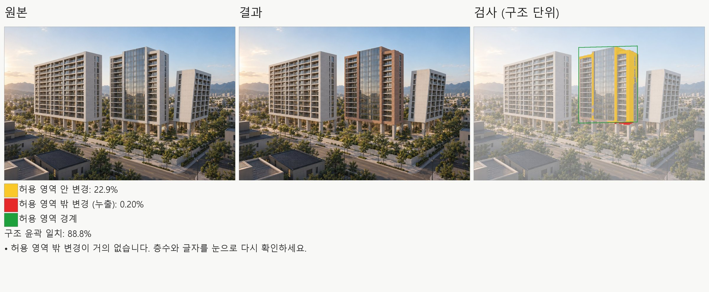

# skills

건축 실무에서 AI 코딩 에이전트와 함께 일하며 굳어진 작업 절차를 스킬로 정리한 저장소입니다. 각 스킬은 `skills/<이름>/SKILL.md` 하나로 시작하고, 필요할 때만 참고 문서와 스크립트를 덧붙입니다. Codex와 Claude Code 양쪽에서 같은 파일을 씁니다.

Reusable agent skills distilled from day-to-day architectural practice with AI coding agents. Each skill lives in `skills/<name>/SKILL.md` and works in both Codex and Claude Code.

## 스킬 목록

| 스킬 | 하는 일 |
|---|---|
| [arch-image-edit-prompts](skills/arch-image-edit-prompts/SKILL.md) | 기존 건축 이미지의 일부만 바꾸는 이미지 생성 프롬프트를 쓰고, 매스·시점이 어긋났을 때 원인을 찾아 고친다. 원본과 결과를 나란히 놓고 허용 영역 밖 변경을 빨갛게 표시하는 검사 스크립트, ChatGPT 웹에서 실제로 실행한 [증거 갤러리(편집 6건)](skills/arch-image-edit-prompts/cases/README.md) 포함 |



위 그림은 증거 갤러리 케이스 01(재질 교체)의 검사 보고다. 가운데 동의 석재를 벽돌로 바꾸라는 편집에서 노란색은 허용 영역 안 변경, 빨간색은 밖으로 새어 나간 변경(필로티 기둥)이다.

## 설치

**Codex**

```bash
python "$CODEX_HOME/skills/.system/skill-installer/scripts/install-skill-from-github.py" \
  --repo <owner>/skills --path skills/arch-image-edit-prompts
```

또는 폴더를 `~/.codex/skills/`에 복사합니다.

**Claude Code**

폴더를 `~/.claude/skills/`(전역) 또는 프로젝트의 `.claude/skills/`에 복사합니다.

## 원칙

- 스킬에는 절차와 판단 기준만 담습니다. 특정 프로젝트의 자료, 이미지, 경로는 넣지 않습니다.
- 예시는 모두 가상 건물입니다.
- 검증되지 않은 방법은 "권장하지 않음"이나 "연구 노트"로 표시하고 성공한 방법처럼 쓰지 않습니다.

## 라이선스

MIT
