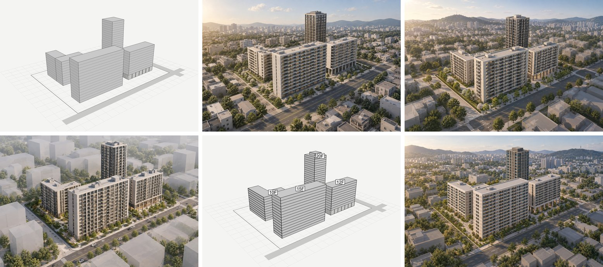

# 증거 갤러리: 매스 캡처 → 렌더

`skills/arch-massing-render-prompts`를 실제 이미지 모델로 실행한 기록이다. 입력은 이 저장소의 스크립트로 만든 가상 매스 캡처이며 실제 프로젝트가 아니다. 도구는 ChatGPT 웹(2026-09-21), 렌더 5건. 각 케이스는 1회 생성이며 보편적 승률을 뜻하지 않는다.

윗줄: 캡처 v1, 케이스 01(구조 프롬프트), 케이스 05(같은 프롬프트 재실행). 아랫줄: 케이스 03(한 줄, 새 대화), 캡처 v2(굵은 층선·층수 라벨·L자 한 덩어리·옥탑 박스), 케이스 04(v2 + 구조 프롬프트 v2).

## 입력

[00_capture](00_capture/): `make_capture.py`가 박스 4동(A 15층 판상형, B 12층 판상형·필로티 2층, C 10층 L자형 두 날개, D 20층 타워), 대지 경계, 도로 2본을 남서쪽 상공 카메라로 투영해 `capture.png`(1536×1024), 윤곽선 `capture_edges.png`, 정답표 `spec.json`을 만든다. 층고 3.1m, 층마다 선 하나. `make_capture_v2.py`는 같은 배치에 층수 보존 대책 네 가지를 넣은 `capture_v2.png`를 만든다.

## 결과

층수는 3배 확대 입면 띠에서 눈으로 센 값(±1). 카메라는 캡처 윤곽을 렌더 위에 빨갛게 겹친 `overlay*.jpg`로 판정.

| 폴더 | 입력 · 프롬프트 · 대화 | 카메라 | A 15 | B 12+필로티 | C 10, 한 동 | D 20 | 판정 |
|---|---|---|---|---|---|---|---|
| [01_B_structured](01_B_structured/) | v1 · 구조 · 새 대화 | 일치 | 13~14 | 10~11, 유지 | 10~11, 두 동처럼 | 22~23 | 부분 통과 |
| [05_B_structured_repeat](05_B_structured_repeat/) | v1 · 01과 동일 · 새 대화 | 일치 | 약 14 | 10~11, 유지 | 약 10, 두 동처럼 | 약 21 | 부분 통과, 01 재현 |
| [02_B_oneliner](02_B_oneliner/) | v1 · 한 줄 · **01과 같은 대화** | 일치 | 14~15 | 약 11, 유지 | 약 10, 이음선 | 24~25 | 부분 통과, 문맥 오염 |
| [03_B_oneliner_fresh](03_B_oneliner_fresh/) | v1 · 한 줄 · 새 대화 | 일치 | 14~15 | 약 11, 유지 | 약 10, 두 동처럼 | 약 26 | 부분 통과(대조군), 차량 추가 |
| [04_B_capture_v2](04_B_capture_v2/) | **v2** · 구조 v2 · 새 대화 | 일치 | 14~15 | 11~12, 유지 | 10~11, **한 동** | 약 22 | 통과에 가장 가까움 |

## 지금까지의 결론

1. **카메라·배치·필로티는 캡처가 잡는다(5/5).** 한 줄 프롬프트로도 동 모서리·대지 경계·도로가 윤곽과 겹쳤고 필로티 기둥이 유지됐다.
2. **형상은 캡처에서 고쳐야 한다.** L자 한 동은 별개 박스로 그린 캡처에서 프롬프트에 써도 4/4 실패했고, 한 덩어리로 그린 캡처(v2)에서 1/1 성공했다.
3. **층수는 어떤 방법으로도 정확히 맞지 않았다.** 판상형은 −1~2(A 13~15, B 10~12), 타워는 +1~6. 방향은 재현된다(01→05). 캡처 대책(굵은 층선, 라벨)을 넣은 04가 A·B에서 1층 정도 낫지만 ±1 오차 안이라 효과를 단정할 수 없다.
4. **구조 프롬프트가 실제로 하는 일**: 재질·조명·주변·금지 항목을 지시대로 만들고(3/3), 타워가 늘어나는 정도를 줄인다(구조 +1~3 ×3회 vs 한 줄 +4~6 ×2회). 층수를 맞추지는 못한다.
5. **같은 대화의 이전 프롬프트는 다음 결과에 문맥으로 작용한다.** 같은 대화의 한 줄(02)은 01처럼 사실적 저층 시가지를 그렸고, 새 대화의 한 줄(03)은 주변을 흰 매스 블록으로, 도로에 차량을 넣었다. 대조군과 다른 안은 새 대화에서 만든다.
6. **캡처 위 층수 라벨은 렌더에 글자로 남지 않았다(1/1, "labels are instructions" 문장과 함께).** 부작용 없이 쓸 수 있으나 층수 효과는 불명.
7. **타워 옥탑 박스는 지붕선을 잡지 못했다(1/1).** 옥탑은 기계실로 그려졌지만 주 지붕은 +2.
8. **사선 뷰에서 기계적 층수 세기는 못 쓴다.** 밝기 주기 방식은 캡처 자체에서도 어긋났다. 확대 띠에서 눈으로 세는 것이 기준이다.

## 한계

- 각 조건 1~2회 생성. 층수 오차 크기는 ±1 안에서 흔들리므로 대책의 미세한 효과는 이 횟수로 가릴 수 없다.
- 캡처 v2는 대책 네 가지를 한 번에 넣었다. 동별로 대상이 달라 C(한 덩어리)와 D(옥탑)는 가릴 수 있었지만, 굵은 층선과 라벨의 효과는 분리되지 않는다.
- 도구는 ChatGPT 웹 하나. gpt-image API나 다른 모델에서 같은 경향인지는 미시험.

## 다음 케이스 (미실행)

- 라벨만 / 굵은 층선만 넣은 캡처로 층수 효과 분리
- 타워 층수 대책: 타워 옆에 같은 높이의 기준 매스를 두거나, 타워를 앞 동에 가리지 않는 카메라로
- 주변을 흰 블록으로 유지하는 요청("keep the surroundings as plain white volumes")을 의도적으로 쓴 매스 스터디용 렌더
- 참고 렌더 첨부(분위기 이식): `arch-image-edit-prompts` 유형 B와 연결
- 같은 프롬프트를 gpt-image API에 넣어 웹 결과와 비교

각 폴더: `prompt.md`(입력과 조건), `result.jpg`(다운로드 원본 PNG를 JPEG로 변환), `verdict.md`(대조표·관찰·판정), 겹침·확대·입면 띠 이미지(01·02는 폴더 바로 아래, 03~05는 `check/`). `compare/`에 여섯 장 나열과 동별 입면 띠 비교가 있다. 겹침·확대 이미지는 `skills/arch-massing-render-prompts/scripts/check_render.py`로 재현한다.
